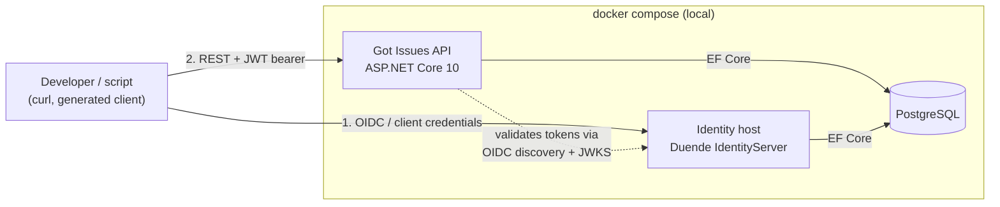

# Architecture Overview

Maintained by the Software Architect persona. This is the current-state map of the system; the *history and rationale* of decisions lives in [`adr/`](adr/README.md). When this overview and an Accepted ADR disagree, the ADR wins and this file has a bug — fix it.

> **State: designed, not yet built.** No application code exists yet (2026-08-30). Everything below describes the intended shape agreed at bootstrap and recorded in [ADR-0003](adr/ADR-0003-initial-technology-stack.md) and [ADR-0004](adr/ADR-0004-contract-first-openapi-code-generation.md). Implementers: where this file and the code disagree once code exists, the code is the truth and this file is a defect.

Keep this file short enough to actually read: a map, not a specification. Detail belongs in ADRs, standards, or the code.

## System context

Got Issues is a single HTTP API for tracking projects, issues, and comments, with a self-hosted identity provider. It has no UI and no external integrations; its users are the company's engineers and their programs. It is **single-tenant** — one deployment serves one company — and there is no requirement to leave room for tenant isolation in the data model.

Everything in the dashed box starts with `docker compose up`; nothing depends on a cloud service or host-installed infrastructure ([`PROJECT.md`](../PROJECT.md) §4).

## System boundaries and major components

| Component | Location | Responsibility | Boundary rule |
| --- | --- | --- | --- |
| **API specification** | `spec/openapi.yaml` (repository root) | The contract: resources, schemas, errors, auth scopes. Authored by hand, first. | The *only* place the product API surface is designed. Nothing downstream may add an endpoint or field the spec does not describe. **Operational endpoints (health, readiness, metrics) are the one exemption** — they are infrastructure, not product surface ([ADR-0005](adr/ADR-0005-operational-endpoints-outside-the-api-contract.md)). |
| **Generated contracts** | `libs/` | Server-side abstract controllers + DTOs (`aspnetcore` generator) and the typed C# client (`csharp` generator). | **Never hand-edited.** Regenerated from the spec; committed so drift is visible in review. |
| **API service** | `apps/` | Implements the generated controller interfaces: request handling, domain logic, persistence. | Contains no route or model definitions of its own — it *implements* generated contracts. |
| **Identity host** | `apps/` | Duende IdentityServer: issues tokens for users and machine clients. | The API never issues or validates credentials itself; it only validates tokens against this host's discovery document. |
| **Database** | PostgreSQL container | Persistence for both the API and the identity host, in separate schemas. | Only the owning component reads or writes its schema — no cross-schema queries. |
| **Compose stack** | `compose.yaml` + `infra/` | Orchestration, service wiring, database initialisation. | The single supported way to run the system. |
| **Delivery framework** | `project-os/` | Governance, backlog, sprints, ADRs, skills. | No source code here; no process artifacts outside here ([ADR-0002](adr/ADR-0002-monorepo-with-self-contained-project-os.md)). |

**The load-bearing boundary is the specification.** Work flows spec → generate → implement, never the reverse ([ADR-0004](adr/ADR-0004-contract-first-openapi-code-generation.md)).

## Data

- **Store:** one PostgreSQL instance; the API and the identity host own separate schemas and never read each other's tables.
- **Ownership:** the API owns projects, issues, comments, and the local projection of users (subject, display name) keyed by the subject claim from the token — upserted from the token on authenticated requests, so issues can be assigned and comments attributed. Duende owns credentials, clients, grants, keys, **and roles** — the API never stores a password, a secret, or a role.
- **Schema source of truth:** EF Core code-first migrations, applied by a dedicated migration step in the compose stack rather than by the API at startup, so schema changes are an explicit, observable action.
- **Personal data:** user display names and email addresses (from the identity provider) are the only personal data anticipated. Minimise it, never log it, and treat any change touching it under [SECURITY.md](../standards/SECURITY.md). Retention policy is `[open]` — no deletion/export flow is designed yet.

## Cross-cutting concerns

- **Configuration:** environment variables injected by Compose; local secrets via `.NET` user-secrets or an untracked `.env` (`.env.example` is the committed template). No secret is ever committed ([SECURITY.md](../standards/SECURITY.md)).
- **Errors:** every failure returns RFC 9457 `application/problem+json`, and the shape is declared in the specification so clients get it generated. Errors are part of the contract, not an implementation detail.
- **Logging & observability:** structured logs via `ILogger`; OpenTelemetry traces and metrics to the console in local runs. No secrets or personal data in logs.
- **Authn/authz:** Duende IdentityServer issues OIDC/OAuth 2.1 tokens; the API is a resource server validating JWT bearer tokens. Machine clients are scoped via client credentials. **User authorization uses two global roles, `admin` and `member`, carried as a claim in the token** (`PROJECT.md` §5) `[confirmed]`. The API reads the claim per request and **never persists a role** — Duende is the source of truth, and role assignment is administrative work performed there, not through this API. This keeps authorization out of the data model entirely: no membership tables, no per-project permission joins, no role table. `admin` additionally covers creating and archiving projects and deleting issues and comments; everything else is open to `member`. A missing or unrecognised role claim is refused, never defaulted upward. Introducing per-project permissions later would be a material change requiring an ADR. Implemented by [T-0009](../product/tickets/T-0009-role-authorisation-and-user-projection.md).
- **Background work:** none. Introducing any requires an ADR.

## Technical constraints

Gathered for convenience; [`PROJECT.md`](../PROJECT.md) §4–5 and the ADRs remain authoritative.

- The whole system must run under Docker Compose, with no host-installed infrastructure beyond Docker and the .NET SDK.
- **Single-tenant**: do not build tenant scoping into the schema, queries, or tokens. Multi-tenancy is permanently out of scope.
- **Not a git forge**: no repositories, git transport, or issue↔commit linking. Self-hosted git is a separate future effort.
- The OpenAPI specification is authored first; controllers and clients are generated from it. Hand-writing generated artefacts is a defect.
- .NET 10 / C# / ASP.NET Core, PostgreSQL via EF Core, Duende IdentityServer — changing any of these requires a superseding ADR.
- Code generation requires a JDK in the developer and CI toolchain (OpenAPI Generator is a Java tool).
- Pagination is mandatory on every collection endpoint; no unbounded result sets.

## Active architectural concerns

| Concern | Why it matters | Tracked as |
| --- | --- | --- |
| Authorisation concentrated in token issuance | The API trusts Duende's role claim completely — correct for this model, but it means an issuance mistake is an authorisation hole with nothing behind it | [T-0009](../product/tickets/T-0009-role-authorisation-and-user-projection.md) |
| Employee personal data in an internal tool | Names and email addresses of real employees; the company's data-protection obligations are unconfirmed | `PROJECT.md` Q8 |
| Shared PostgreSQL instance for API + identity | Simple for local development; couples two components' availability and backup story. Acceptable while local-only, revisit before any deployment | this file |
| Generated code committed to the repository | Makes drift reviewable, but produces large diffs and merge noise. Revisit if it becomes painful | [ADR-0004](adr/ADR-0004-contract-first-openapi-code-generation.md) |
| Duende runs unlicensed | A deliberate, informed PoC-scoped decision by the maintainer — not a risk to track, recorded here so nobody re-raises it | `PROJECT.md` §4 |
